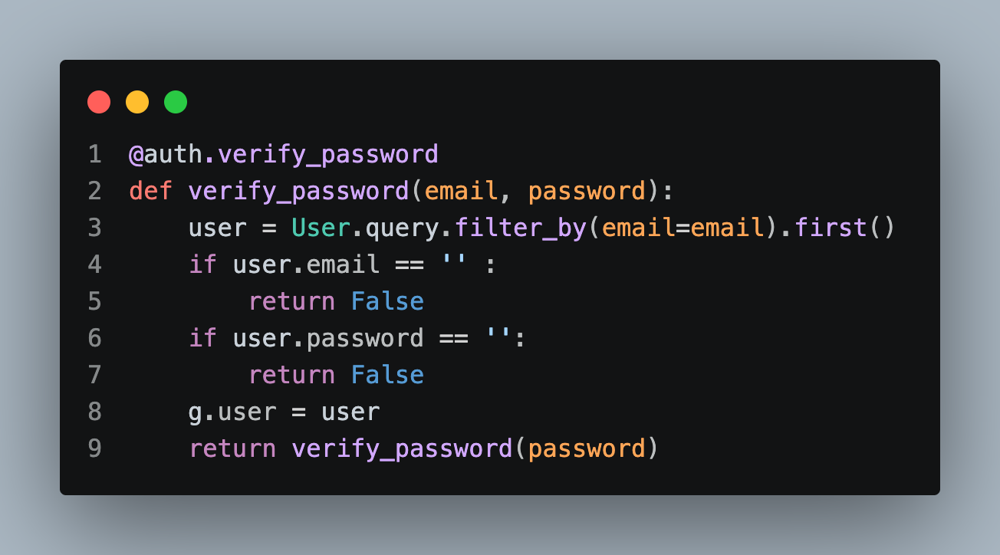

# 개발일지 

## block1 
### 1. 구현 목적: Flask - HttpAuth initialization 

### 2.개발흐름 :
**왜 extension을 써야만 하는가?**
기존 웹 애플리케이션은 쿠키/세션 사용 => 브라우저는 쿠키를 자동 관리하지만 Api의 클라이언트는 직접 관리가 필요 => 따라서 API에서는 HTTP Authentication header를 이용한 인증방식을 채택 => flask에서 다룰 수 있는 flask-HTTPAuth 라이브러리를 사용한다. 
[구현코드](https://github.com/hardthink26/review_app_project/blob/f8e23879b8a1243ccfbee5c3f24dba5517c67d7f/app/api/authentication.py#L6-L14)
1. 이메일과 비밀번호를 각각 검사 
	- 만약 이메일이 없다면 False반환 
	- 유저가 없다면 False 반환 
2. User model의 비밀번호 인증 메소드를 적용하여 일치 시 True를 반환 

### 3.병목점/이유: 

1. if 조건문 user.password/user.email과 같은 DB모델에서 가져온 객체 값 검사 
	- 확인하려는 값은 DB값이 아닌 Http authentication header의 값 
2. 결과 반환 과정에서 User.verify_password 메소드와 현재 verify_password 콜백 함수를 혼동 
	- 현재 함수를 다시 호출하는 구조가 됨 
	- return user.verify_password(password)로 수정하여 비밀번호 인증 여부를 호출하도록 수정 
	
## block2
### 1. 구현 목적: before_request handler with authentication
- 모든 route에 대한 authentication check를 진행한다. 

### 2.개발흐름 :
1. 모든 request 실행 전에 검사 =>  before_request라는 setup method사용 
	- request 실행 전에 실행 함수를 등록하는 과정 
2. 만약 유저가 confirm되어있지않다면 403 에러가 나도록 설정 
[구현코드](https://github.com/hardthink26/review_app_project/blob/30bf5a006b54453c40566e1fae555ac6774e2afa/app/api/authentication.py#L23-L27)
### 3.병목점/이유: 
1. 책에서는 g.current_user.is_anonymous사용함 
	- 하지만 이미 익명성 여부는 유저의 authentication인증 False과정에 포함되어서 코드엔 작성x 

## block3
### 1. 구현 목적: 

### 2.개발흐름 :

### 3.병목점/이유: 
---
### 배울 지점: 

### Next: Token Baed Authentication 

