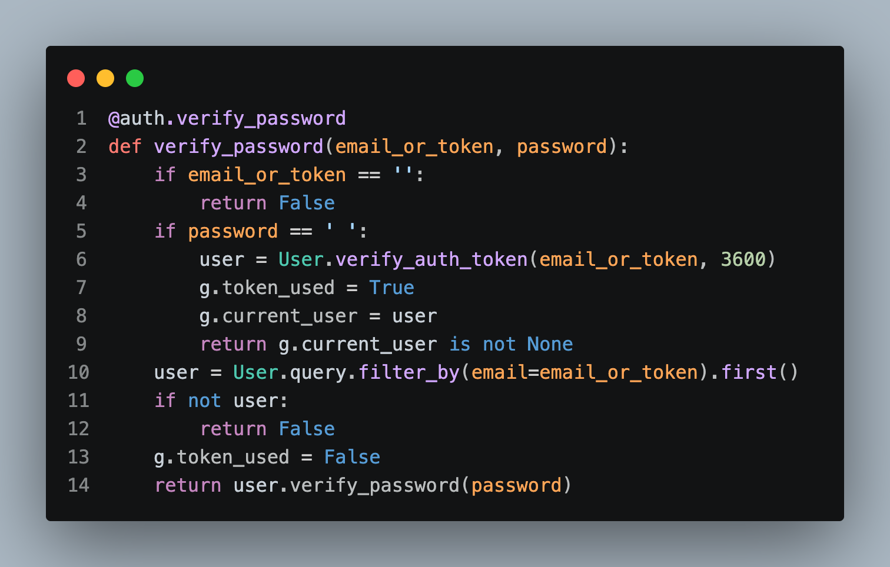

# 개발일지 

## block1 
### 1. 구현 목적: improved auth verification with token support 

### 2.개발흐름 :
[구현코드](https://github.com/hardthink26/review_app_project/blob/ef8f4db5f210e5e7605283ebd82411d5c2ed2fe2/app/api/authentication.py#L8-L22)
1. 기존 이메일 검증 로직에서 이메일+토큰 형식으로 변형 
2. 만약 pw가 없다면 위의 1번에서 토큰을 받았음을 가정 후 토큰 검증 로직 작성 [관련내용](2026-09-29.md#my_block)

### 3.병목점/이유: 

`g.current_user`를 생략 
-  이미 if절 지나고 저장이 된걸로 인지 
	- 하지만 10번째 줄부터는 역할이 다르다. 
		- 이메일 인증 파트이며 유저 검증이 다시 필요하다. 

## block2
### 1. 구현 목적: 

### 2.개발흐름 :

### 3.병목점/이유: 

## block3
### 1. 구현 목적: 

### 2.개발흐름 :

### 3.병목점/이유: 
---
### 배울 지점: 

### Next: 

