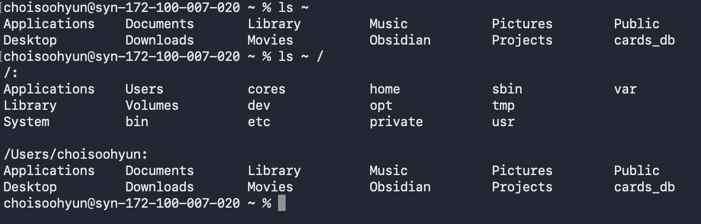

## More Fun With **ls** 
### ls 명령어의 정의 
- List directory contents 

**사용법** 
```zsh 
% ls ~/usr 
% ls ~ /usr 
*/이 둘의 결과는 다릅니다. 위의 결과는 홈디렉터리 안 usr폴더를 보는 것이며 아래 ~(tilde)+ /usr의 리스트를 각각 따로 보는 것을 의미합니다.*/ 
```


### 더 많은 디테일을 원한다면? 
- 명령어 **-l**사용 가능합니다. 
- **사용법** 
```zsh 
% ls -l 
# long format으로 아웃풋 변경 가능합니다. 
```

## Options and Arguments 
