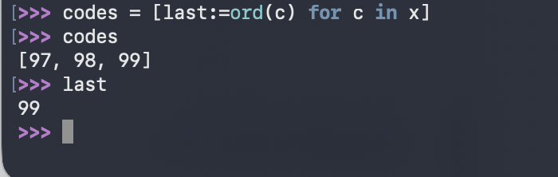

## Overview of Bulit-in Sequences 
- standard library가 제공하는 sequence types 
	- Container sequences
		- 여러 타입의 item을 받을 수 있으며, 중첩도 가능합니다. 
		- holds references to the objects it contains 
		- ex) **list**, **tuple**, and **collections.deque** 
	- Flat sequences 
		- 하나의 simple type 가질 수 있습니다. 
		- store the value. of its contents in its own memory 
		- ex) **str**, **bytes**, and **array.array** 

- sequence types by mutability 
	- Mutable sequences 
		- ex) **list**, **bytearray**, ...
	- Immutable sequences 
		- ex) **tuple**, **str**, and **bytes** 

- ### sequence ABC 
	- **mutablesequence**는 **sequence**에 수정 관련 연산 추가 
	-  list, array 등은 각각 mutablesequence, sequence에 직접 상속이 아님 
	- 하지만 virtual subclasses에 등록되어 issubclass()를 통해 True 반환 가능 

## List comprehensions and Generator Expressions 
- 줄여서 Listcomp라고도 표현 
- listcomps VS for loop 
	- new list 생성시 -> listcomps사용 
	- 생성된 리스트는 필요x side effect 필요시 -> for문 사용 
	- 코드가 복잡? -> for loop사용 

- ### Comprehesion Scope 
	- comp의 반복 변수는 comp 내부서만 존재 
	- :=(walrus operator) 할당 변수는 comp이후에도 접근 가능 
 

## Listcomps and Versus map and filter 
- map & filter가 하는 것은 다 Listcomprehension이 가능합니다. 

## Cartesian Products 
